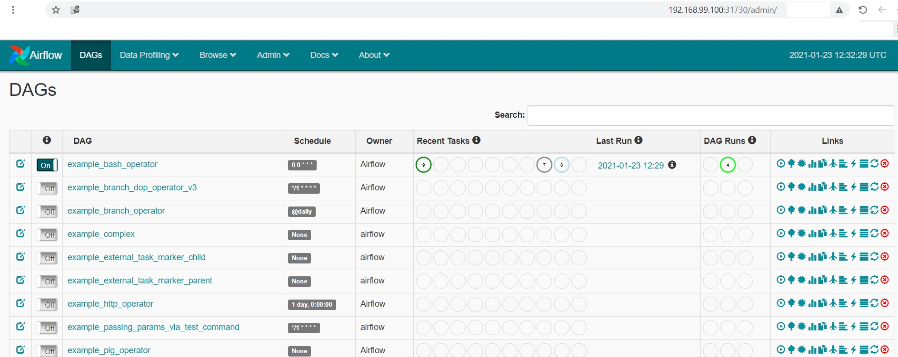
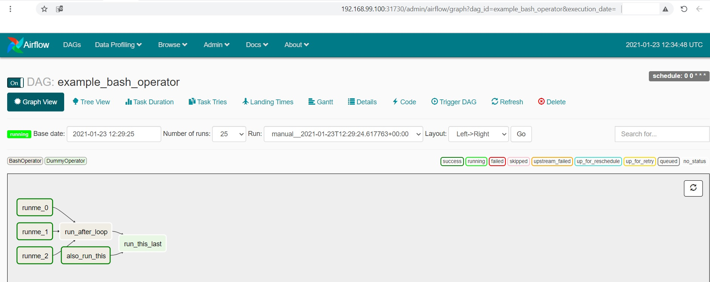

# airflowplus 

## command set
```
kubectl apply -f airflowplus.yml
kubectl apply -f airflowplus_namespace.yml
```

## expose ports for web-server, redis, postgres
```
kubectl expose deployment airflowplus --type NodePort --port 8080,6379,5432 -n airflowplus
```

## showing deployment
```
kubectl get all -n airflowplus
```
```

NAME                               READY   STATUS    RESTARTS   AGE
pod/airflowplus-6bdf569756-b848w   3/3     Running   0          5m31s

NAME                  TYPE       CLUSTER-IP      EXTERNAL-IP   PORT(S)                                        AGE
service/airflowplus   NodePort   10.107.46.171   <none>        8080:31730/TCP,6379:30555/TCP,5432:31483/TCP   19s

NAME                          READY   UP-TO-DATE   AVAILABLE   AGE
deployment.apps/airflowplus   1/1     1            1           5m31s

NAME                                     DESIRED   CURRENT   READY   AGE
replicaset.apps/airflowplus-6bdf569756   1         1         1       5m31s

```

## showing service/airflowplus
```
kubectl describe service airflowplus -n airflowplus
```
```

Name:                     airflowplus
Namespace:                airflowplus
Labels:                   app=airflowplus
Annotations:              <none>
Selector:                 app=airflowplus
Type:                     NodePort
IP Families:              <none>
IP:                       10.107.46.171
IPs:                      10.107.46.171
Port:                     port-1  8080/TCP
TargetPort:               8080/TCP
NodePort:                 port-1  31730/TCP
Endpoints:                172.17.0.6:8080
Port:                     port-2  6379/TCP
TargetPort:               6379/TCP
NodePort:                 port-2  30555/TCP
Endpoints:                172.17.0.6:6379
Port:                     port-3  5432/TCP
TargetPort:               5432/TCP
NodePort:                 port-3  31483/TCP
Endpoints:                172.17.0.6:5432
Session Affinity:         None
External Traffic Policy:  Cluster
Events:                   <none>

```

## showing running pods (partial)
```
kubectl describe pods -n airflowplus
```
```
Controlled By:  ReplicaSet/airflowplus-5c8648756d
Containers:
  docker-airflow:
    Container ID:   docker://f6fd7c89ff1d9d4c796c6b201e8afd508b5013e3a3b41c2e0d26b361d9c2f764
    Image:          puckel/docker-airflow:latest
    Image ID:       docker-pullable://puckel/docker-airflow@sha256:e3012994e4e730dccf56878094ff5524bffbe347e5870832dd6f7636eb0292a4
    Port:           <none>
    Host Port:      <none>
    State:          Running
      Started:      Sat, 23 Jan 2021 14:07:35 +0200
    Ready:          True
    Restart Count:  0
    Environment:
      LOAD_EX:  y
    Mounts:
      /var/run/secrets/kubernetes.io/serviceaccount from default-token-6qxkj (ro)
  redis:
    Container ID:   docker://ea62ea5cbadcfec916a1351987b71d3150aa79432d395e5c189ead5c82dd6611
    Image:          redis:latest
    Image ID:       docker-pullable://redis@sha256:0f97c1c9daf5b69b93390ccbe8d3e2971617ec4801fd0882c72bf7cad3a13494
    Port:           <none>
    Host Port:      <none>
    State:          Running
      Started:      Sat, 23 Jan 2021 14:07:37 +0200
    Ready:          True
    Restart Count:  0
    Environment:
      LOAD_EX:  y
    Mounts:
      /var/run/secrets/kubernetes.io/serviceaccount from default-token-6qxkj (ro)
  postgres:
    Container ID:   docker://1de6f2fd14f922aecfcca3145db18257ad6ee2301ed244beee7c3ef30871f286
    Image:          postgres:latest
    Image ID:       docker-pullable://postgres@sha256:c32f3f8364d79f71958c9ada74c43c2033d7e13d9d5fc21d3ba89322e6559c9d
    Port:           <none>
    Host Port:      <none>
    State:          Running
      Started:      Sat, 23 Jan 2021 14:07:40 +0200
    Ready:          True
    Restart Count:  0
    Environment:
      POSTGRES_HOST_AUTH_METHOD:  trust
      POSTGRES_PASSWORD:          password
      LOAD_EX:                    y
```

## set LOAD_EX=y into deployment
```
kubectl set env deployment airflowplus LOAD_EX=y -n airflowplus
deployment.apps/airflowplus env updated
```

## restart deployment in order to activate new parameter above
```
kubectl scale deployment airflowplus --replicas=0 -n airflowplus
deployment.apps/airflowplus scaled
```
```
kubectl scale deployment airflowplus --replicas=1 -n airflowplus
deployment.apps/airflowplus scaled
```

## output


